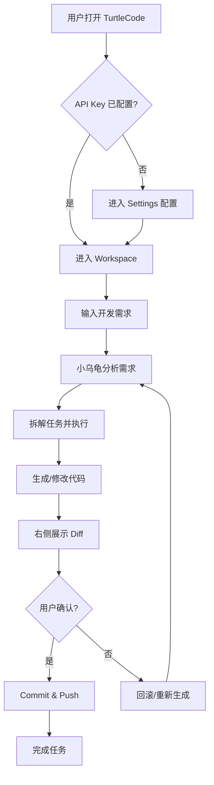

# TurtleCode（乌龟码）产品需求文档

## 1. 产品概述

TurtleCode 是一款基于 DeepSeek V4 的 AI Agent 编程工具。用户通过自然语言与“小乌龟”对话完成需求分析、代码生成、项目修改、GitHub 管理等开发任务。产品核心理念为“聊天是核心，代码是结果”，目标是为开发者提供 DeepSeek 深度优化的聊天式编程体验。

## 2. 核心功能

### 2.1 用户角色

| 角色 | 注册方式 | 核心权限 |
|------|----------|----------|
| 普通用户 | 邮箱 / GitHub OAuth | 创建项目、AI 对话、管理设置、安装插件 |

### 2.2 功能模块

1. **Settings（设置页）**：模型选择、API Key 配置、缓存开关、命中率/Token/费用统计、小乌龟状态动画
2. **Workspace（工作台）**：左侧 70% AI 聊天区，右侧 30% Agent 工作区，底部状态栏，文件 Diff 展示
3. **Skills（技能中心）**：左侧已安装插件，右侧插件市场，支持启用/配置/安装插件

### 2.3 页面详情

| 页面 | 模块 | 功能描述 |
|------|------|----------|
| Settings | 模型选择 | DeepSeek V4 Flash / Pro 切换 |
| Settings | API 配置 | API Key 输入、测试连接、保存 |
| Settings | 缓存配置 | 启用缓存/语义缓存/上下文压缩 |
| Settings | 统计面板 | 缓存命中率、Token 节省、费用节省 |
| Settings | 小乌龟动画 | 待机/思考/完成任务状态 |
| Workspace | 聊天区 | 消息历史、多模态输入、实时 Token 统计 |
| Workspace | Agent 工作区 | 当前编辑文件、Diff、新增/删除代码 |
| Workspace | 状态栏 | 模型、Token、缓存命中率、GitHub/Agent 状态 |
| Skills | 我的技能 | 已安装插件列表、启用/禁用/配置/删除 |
| Skills | 插件市场 | 卡片式插件、搜索/分类/排序、安装 |

## 3. 核心流程

用户打开 TurtleCode 后，进入 Workspace 页面。首次使用需前往 Settings 配置 DeepSeek API Key 并选择模型。返回 Workspace 输入开发需求，小乌龟理解需求后分析项目、拆解任务、生成或修改代码，右侧 Agent 工作区实时展示文件变更与 Diff。用户确认后，Agent 自动 Commit 并 Push 到 GitHub。用户可在 Skills 页面安装/配置插件扩展 Agent 能力。

## 4. 用户界面设计

### 4.1 设计风格

- **整体风格**：现代科技风、深色模式、Glassmorphism 毛玻璃、圆角、柔和阴影、流光效果
- **主色**：`#2563EB`（科技蓝）
- **辅助色**：`#3B82F6`（亮蓝）
- **强调色**：`#06B6D4`（科技青）
- **高亮色**：`#22D3EE`（亮青）
- **背景**：深蓝黑渐变
- **按钮**：圆角、呼吸光效、悬停流光边框
- **字体**：等宽字体用于代码，无衬线字体用于界面
- **图标/动画**：像素风格小乌龟，状态包括待机爬行、思考探头、编辑敲代码、调用插件背图标、完成挥手

### 4.2 页面设计概览

| 页面 | 模块 | UI 元素 |
|------|------|---------|
| Settings | 配置面板 | 毛玻璃卡片、开关、输入框、测试按钮、统计数字 |
| Settings | 小乌龟 | 右上角像素乌龟动画，随状态切换 |
| Workspace | 聊天区 | 消息气泡、代码块、输入框、Token 统计条 |
| Workspace | Agent 区 | 文件列表、Monaco Diff、状态标签 |
| Workspace | 状态栏 | 底部固定栏，显示模型/Token/缓存/GitHub/Agent 状态 |
| Skills | 插件列表 | 卡片、图标、版本、开关、配置按钮 |
| Skills | 插件市场 | 网格卡片、搜索框、分类筛选、排序下拉 |

### 4.3 响应式

桌面优先，左侧聊天区与右侧 Agent 区在中大屏幕保持 70/30 比例。小屏幕下 Agent 区可折叠为抽屉，聊天区占满宽度。

### 4.4 动画指导

- 页面切换：淡入淡出
- 按钮：悬停时呼吸光效、流光边框
- 小乌龟：像素帧动画，根据 Agent 状态切换 Sprite
- 代码生成：打字机效果 + 代码高亮逐行显示
- 消息进入：从底部滑入 + 透明度渐变
