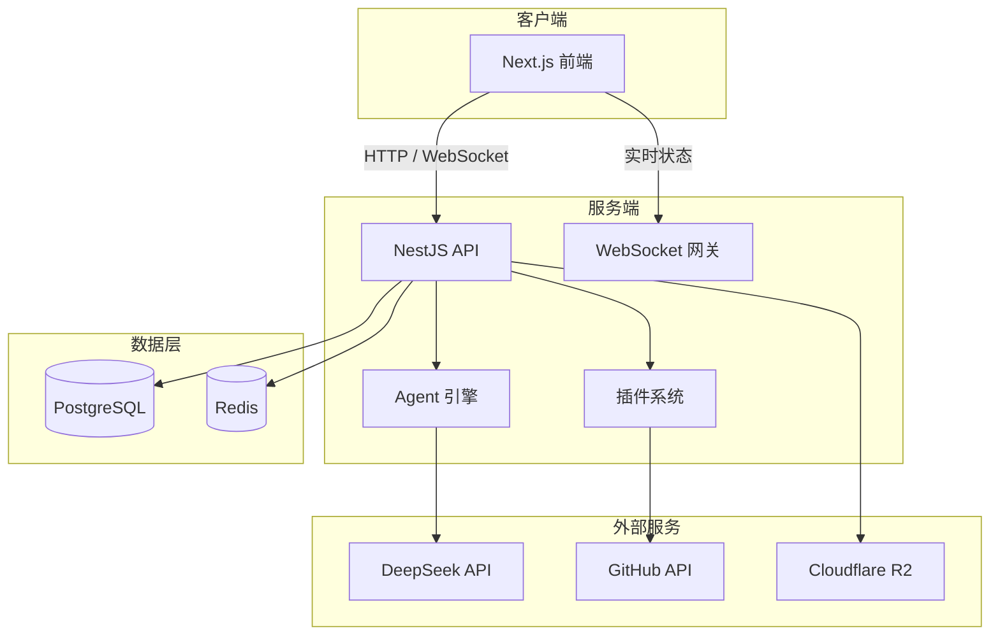
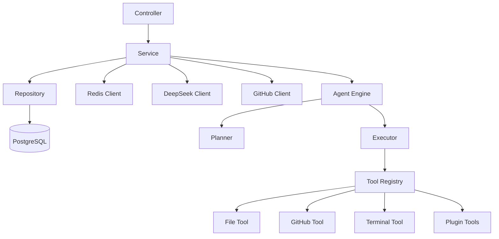
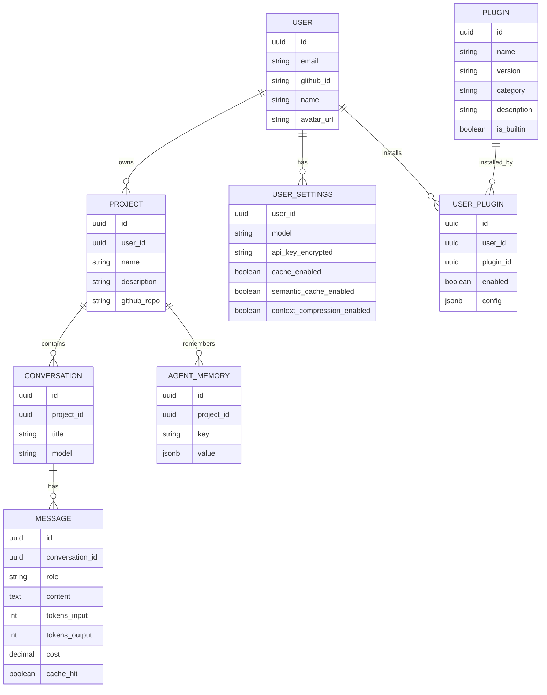

# TurtleCode（乌龟码）技术架构文档

## 1. 架构设计



## 2. 技术说明

- **前端**：Next.js 14 + TypeScript + TailwindCSS + Shadcn UI + Framer Motion
- **代码编辑器**：Monaco Editor（Diff 展示、语法高亮）
- **后端**：NestJS 10 + Node.js 20
- **数据库**：PostgreSQL 15
- **缓存**：Redis 7（基础缓存、语义缓存、Agent Memory）
- **实时通信**：WebSocket（NestJS Gateway）
- **对象存储**：Cloudflare R2（可选，用于插件资源）
- **部署**：Render（Web Service + PostgreSQL + Redis）
- **代码管理**：GitHub（OAuth、Commit、Push、Pull、分支）

## 3. 路由定义

| 路由 | 用途 |
|------|------|
| `/` | 默认重定向到 `/workspace` |
| `/workspace` | AI 工作台（聊天 + Agent 区） |
| `/settings` | API/模型/缓存配置中心 |
| `/skills` | 技能中心与插件市场 |
| `/api/*` | NestJS API 路由 |

## 4. API 定义

### 4.1 设置

```typescript
// GET /api/settings
interface SettingsResponse {
  model: 'deepseek-v4-flash' | 'deepseek-v4-pro';
  apiKeyConfigured: boolean;
  cacheEnabled: boolean;
  semanticCacheEnabled: boolean;
  contextCompressionEnabled: boolean;
  cacheHitRate: number;
  tokensSaved: number;
  costSaved: number;
}

// POST /api/settings
interface UpdateSettingsRequest {
  model?: string;
  apiKey?: string;
  cacheEnabled?: boolean;
  semanticCacheEnabled?: boolean;
  contextCompressionEnabled?: boolean;
}
```

### 4.2 对话

```typescript
// POST /api/chat
interface ChatRequest {
  conversationId?: string;
  projectId: string;
  message: string;
}

// SSE / WebSocket
interface ChatStreamEvent {
  type: 'token' | 'tool_call' | 'diff' | 'status' | 'done' | 'error';
  payload: unknown;
}
```

### 4.3 项目

```typescript
// GET /api/projects
interface Project {
  id: string;
  name: string;
  description: string;
  githubRepo?: string;
  createdAt: string;
}

// POST /api/projects
interface CreateProjectRequest {
  name: string;
  description?: string;
  githubRepo?: string;
}
```

### 4.4 插件

```typescript
// GET /api/plugins
interface Plugin {
  id: string;
  name: string;
  version: string;
  category: string;
  description: string;
  icon: string;
  installed: boolean;
  enabled: boolean;
}

// POST /api/plugins/:id/install
// POST /api/plugins/:id/configure
interface PluginConfigRequest {
  config: Record<string, unknown>;
}
```

## 5. 服务端架构图



## 6. 数据模型

### 6.1 ER 图



### 6.2 数据定义语言

```sql
CREATE EXTENSION IF NOT EXISTS "uuid-ossp";

CREATE TABLE users (
  id UUID PRIMARY KEY DEFAULT uuid_generate_v4(),
  email VARCHAR(255) UNIQUE NOT NULL,
  github_id VARCHAR(100),
  name VARCHAR(100),
  avatar_url TEXT,
  created_at TIMESTAMP DEFAULT NOW()
);

CREATE TABLE projects (
  id UUID PRIMARY KEY DEFAULT uuid_generate_v4(),
  user_id UUID REFERENCES users(id) ON DELETE CASCADE,
  name VARCHAR(255) NOT NULL,
  description TEXT,
  github_repo TEXT,
  created_at TIMESTAMP DEFAULT NOW()
);

CREATE TABLE conversations (
  id UUID PRIMARY KEY DEFAULT uuid_generate_v4(),
  project_id UUID REFERENCES projects(id) ON DELETE CASCADE,
  title VARCHAR(255),
  model VARCHAR(50),
  created_at TIMESTAMP DEFAULT NOW()
);

CREATE TABLE messages (
  id UUID PRIMARY KEY DEFAULT uuid_generate_v4(),
  conversation_id UUID REFERENCES conversations(id) ON DELETE CASCADE,
  role VARCHAR(20) NOT NULL,
  content TEXT NOT NULL,
  tokens_input INTEGER,
  tokens_output INTEGER,
  cost DECIMAL(10,6),
  cache_hit BOOLEAN DEFAULT FALSE,
  created_at TIMESTAMP DEFAULT NOW()
);

CREATE TABLE user_settings (
  user_id UUID PRIMARY KEY REFERENCES users(id) ON DELETE CASCADE,
  model VARCHAR(50) DEFAULT 'deepseek-v4-flash',
  api_key_encrypted TEXT,
  cache_enabled BOOLEAN DEFAULT TRUE,
  semantic_cache_enabled BOOLEAN DEFAULT FALSE,
  context_compression_enabled BOOLEAN DEFAULT FALSE,
  updated_at TIMESTAMP DEFAULT NOW()
);

CREATE TABLE plugins (
  id UUID PRIMARY KEY DEFAULT uuid_generate_v4(),
  name VARCHAR(255) NOT NULL,
  version VARCHAR(50) NOT NULL,
  description TEXT,
  category VARCHAR(50),
  icon_url TEXT,
  package_url TEXT,
  is_builtin BOOLEAN DEFAULT FALSE,
  created_at TIMESTAMP DEFAULT NOW()
);

CREATE TABLE user_plugins (
  id UUID PRIMARY KEY DEFAULT uuid_generate_v4(),
  user_id UUID REFERENCES users(id) ON DELETE CASCADE,
  plugin_id UUID REFERENCES plugins(id) ON DELETE CASCADE,
  enabled BOOLEAN DEFAULT TRUE,
  config JSONB,
  installed_at TIMESTAMP DEFAULT NOW(),
  UNIQUE(user_id, plugin_id)
);

CREATE TABLE agent_memory (
  id UUID PRIMARY KEY DEFAULT uuid_generate_v4(),
  project_id UUID REFERENCES projects(id) ON DELETE CASCADE,
  key VARCHAR(255) NOT NULL,
  value JSONB NOT NULL,
  created_at TIMESTAMP DEFAULT NOW()
);
```
